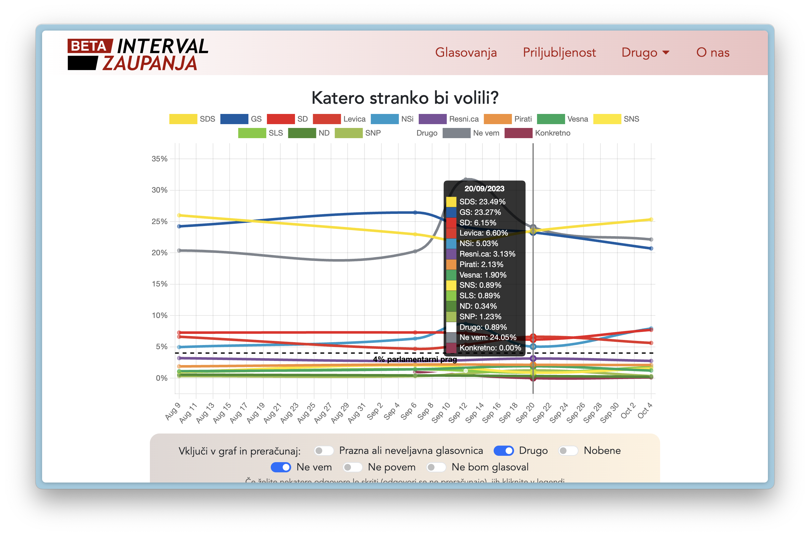

# Interval zaupanja

Interval zaupanja je agregator in vizualizator sociopolitičnih javnomenjskih anket v Sloveniji. Za čelni del (frontend) se uporablja ogrodje Vue, za zaledni del pa node.js API strežnik `https://interval-zaupanja.onrender.com/api/` (gostujoč na OnRender), ki je povezan z MongoDB (Atlas) dokumentno podatkovno bazo. Poleg tega je na povezavi [https://https://interval-zaupanja.onrender.com/api/docs/] na voljo dokumentacija napisana s pomočjo orodja Swagger in v OpenAPI specifikaciji. Projekt je trenutno v **BETA** fazi.

Spletna stran gosti na GitHub Pages na povezavi [https://interval-zaupanja.github.io/web-app]

## Znane težave

- Pogledi Izvajalec, Zaloznik, Stranka in Oseba niso prilagojeni ožjim zaslonom
- Spustni meni 'Drugo' v glavi nima zameglenega ozadja
  - CSS to očitno ne podpira v primeru, da ima starševski element že zamegljeno ozadje
  - Rešitev je morda, da je starševski element netransparentne rdeče barve, kar bi omogočilo 'Drugo' spustnemu meniju, da ima zamegljeno ozadje
- Osebe nimajo slik: začasno onemogočene na strani API strežnika do ureditve avtorskih pravic
  - Kljub temu pa so slike že podprte, tudi znotraj horizontalnega grafa priljubljenosti